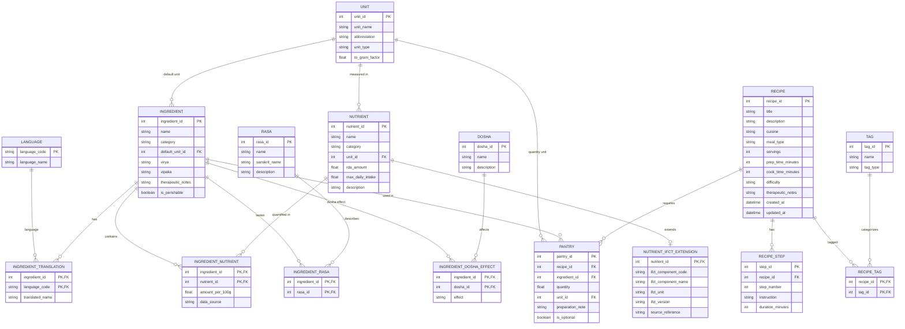

# Recipe & Pantry Database Schema

## Overview

This is a normalized relational schema for a recipe/pantry system: ingredients with per-100g nutrient profiles, a nutrient table extensible to external datasets (starting with IFCT), and recipes linked to steps and to the ingredients they draw from via a `pantry` bridge table.

**Assumption:** since this looks like it's for Pākakṛti, I've folded in the pieces that app already needs — Ayurvedic properties on ingredients (rasa, virya, vipaka, dosha effects) and multilingual ingredient names (en/hi/mr). If this is for something else, the Ayurvedic and translation tables (marked below) are self-contained — drop them and the core Ingredient / Nutrient / Recipe / Pantry design still stands on its own.

The DDL targets SQLite (`INTEGER PRIMARY KEY AUTOINCREMENT`). Porting to Postgres just means swapping that for `SERIAL` / `GENERATED ALWAYS AS IDENTITY` — column types and constraints carry over directly.

---

## Entity-Relationship Diagram



---

## Design notes on the four requested pieces

**Ingredient → Nutrient.** Rather than columns like `protein`, `iron`, `vitamin_c` on the ingredient table, values live in a junction table, `ingredient_nutrient(ingredient_id, nutrient_id, amount_per_100g)`. That's what lets you add a new nutrient later without a migration, and lets `data_source` record whether a given number came from IFCT, USDA, or a manual estimate.

**Nutrient table.** "Name" and "max consumption per day" are columns on `nutrient` directly (`name`, `max_daily_intake`, plus `rda_amount` since you'll usually want both the target and the ceiling). "Value" — the actual per-food amount — isn't a nutrient-table column at all; it's the `amount_per_100g` in the junction table above, since a nutrient's value is only meaningful *per ingredient*.

**Nutrient extension table (IFCT).** `nutrient_ifct_extension` is a 1:1 extension of `nutrient`, keyed on the same `nutrient_id`. It holds only IFCT-specific fields (component code, IFCT's own label, IFCT's reported unit, dataset version) so the core `nutrient` table stays clean. IFCT 2017 largely follows the international INFOODS tagname convention (`PROCNT` for protein, `FAT`, `CHOCDF` for carbohydrate, `FIBTG`, `CA`, `FE`, …) — treat the example codes below as illustrative and match them to whatever identifier scheme your actual IFCT import uses. The extension pattern generalizes: a `nutrient_usda_extension` table later would look the same shape, joined on the same key.

**Recipe → Steps → Pantry.** One clarification on direction: `recipe_step` and `pantry` each hold a `recipe_id` foreign key pointing *back* to `recipe` (not the reverse) since one recipe has many steps and many pantry lines — a single `recipe.step_id` column couldn't represent that. `pantry` is the bridge table carrying both `recipe_id` and `ingredient_id`, plus the quantity and unit for that specific use — this is what makes it a many-to-many between recipes and ingredients rather than a plain lookup.

---

## Reference tables

A few small lookup tables back the above, so free-text values (units, languages, dosha names, taste names, tags) stay consistent and joinable rather than repeated as strings everywhere:

| Table | Purpose |
|---|---|
| `unit` | Canonical units (gram, ml, tsp…) with a `to_gram_factor` for mass units, so nutrient math can normalize across units. |
| `language` | The languages an ingredient name can be translated into (`en`, `hi`, `mr`, extensible). |
| `dosha` | The three doshas (Vata, Pitta, Kapha), referenced by `ingredient_dosha_effect`. |
| `rasa` | The six Ayurvedic tastes, referenced by `ingredient_rasa` (an ingredient can carry more than one). |
| `tag` | Free-form recipe labels — diet, cuisine, occasion, or guna (Sattvic/Rajasic/Tamasic) — via `recipe_tag`. |

---

## Full DDL

```sql
-- ============================================================
-- Reference / lookup tables
-- ============================================================

CREATE TABLE units (
    unit_id         INTEGER PRIMARY KEY AUTOINCREMENT,
    unit_name       TEXT NOT NULL,                 -- 'gram', 'milliliter', 'teaspoon'
    abbreviation    TEXT NOT NULL,                 -- 'g', 'ml', 'tsp'
    unit_type       TEXT NOT NULL CHECK (unit_type IN ('mass','volume','count')),
    to_gram_factor  REAL                           -- NULL for volume/count units
);

CREATE TABLE languages (
    language_code   TEXT PRIMARY KEY,              -- 'en', 'hi', 'mr'
    language_name   TEXT NOT NULL
);

CREATE TABLE doshas (
    dosha_id        INTEGER PRIMARY KEY AUTOINCREMENT,
    name            TEXT NOT NULL UNIQUE,          -- 'Vata', 'Pitta', 'Kapha'
    description     TEXT
);

CREATE TABLE rasas (
    rasa_id         INTEGER PRIMARY KEY AUTOINCREMENT,
    name            TEXT NOT NULL,                 -- 'Sweet','Sour','Salty','Pungent','Bitter','Astringent'
    sanskrit_name   TEXT,                          -- 'Madhura','Amla','Lavana','Katu','Tikta','Kashaya'
    description     TEXT
);

CREATE TABLE tags (
    tag_id          INTEGER PRIMARY KEY AUTOINCREMENT,
    name            TEXT NOT NULL UNIQUE,          -- 'Vegetarian', 'Vrat', 'Sattvic', 'North Indian'
    tag_type        TEXT NOT NULL CHECK (tag_type IN ('diet','cuisine','occasion','guna'))
);

-- ============================================================
-- Ingredient domain
-- ============================================================

CREATE TABLE ingredients (
    ingredient_id     INTEGER PRIMARY KEY AUTOINCREMENT,
    name              TEXT NOT NULL,                -- canonical English name
    category          TEXT,                         -- grain, vegetable, dairy, spice, legume, fruit...
    default_unit_id   INTEGER REFERENCES units(unit_id),
    virya             TEXT CHECK (virya IN ('Heating','Cooling','Neutral')),
    vipaka            TEXT CHECK (vipaka IN ('Sweet','Sour','Pungent')),
    therapeutic_notes TEXT,
    is_perishable     BOOLEAN NOT NULL DEFAULT 0
);

CREATE TABLE ingredient_translations (
    ingredient_id    INTEGER NOT NULL REFERENCES ingredients(ingredient_id),
    language_code    TEXT NOT NULL REFERENCES languages(language_code),
    translated_name  TEXT NOT NULL,
    PRIMARY KEY (ingredient_id, language_code)
);

CREATE TABLE ingredient_rasas (
    ingredient_id  INTEGER NOT NULL REFERENCES ingredients(ingredient_id),
    rasa_id        INTEGER NOT NULL REFERENCES rasas(rasa_id),
    PRIMARY KEY (ingredient_id, rasa_id)
);

CREATE TABLE ingredient_dosha_effects (
    ingredient_id  INTEGER NOT NULL REFERENCES ingredients(ingredient_id),
    dosha_id       INTEGER NOT NULL REFERENCES doshas(dosha_id),
    effect         TEXT NOT NULL CHECK (effect IN ('increases','decreases','neutral')),
    PRIMARY KEY (ingredient_id, dosha_id)
);

-- ============================================================
-- Nutrient domain
-- ============================================================

CREATE TABLE nutrients (
    nutrient_id      INTEGER PRIMARY KEY AUTOINCREMENT,
    name             TEXT NOT NULL UNIQUE,          -- 'Vitamin C', 'Iron', 'Protein'
    category         TEXT CHECK (category IN ('macro','vitamin','mineral','other')),
    unit_id          INTEGER NOT NULL REFERENCES units(unit_id),  -- mg, mcg, g, kcal
    rda_amount       REAL,                          -- Recommended Dietary Allowance
    max_daily_intake REAL,                          -- Tolerable Upper Intake Level
    description      TEXT
);

-- 1:1 extension — keeps IFCT-specific metadata off the core table.
-- A future nutrient_usda_extension would follow the same shape.
CREATE TABLE nutrient_ifct_extension (
    nutrient_id          INTEGER PRIMARY KEY REFERENCES nutrients(nutrient_id),
    ifct_component_code  TEXT NOT NULL,             -- e.g. 'PROCNT', 'FAT', 'FIBTG'
    ifct_component_name  TEXT NOT NULL,             -- IFCT's own label for the component
    ifct_unit            TEXT NOT NULL,             -- unit as reported in the IFCT tables
    ifct_version         TEXT NOT NULL DEFAULT 'IFCT 2017',
    source_reference     TEXT
);

CREATE TABLE ingredient_nutrients (
    ingredient_id    INTEGER NOT NULL REFERENCES ingredients(ingredient_id),
    nutrient_id      INTEGER NOT NULL REFERENCES nutrients(nutrient_id),
    amount_per_100g  REAL NOT NULL,
    data_source      TEXT,                          -- 'IFCT 2017', 'USDA', 'manual'
    PRIMARY KEY (ingredient_id, nutrient_id)
);

-- ============================================================
-- Recipe domain
-- ============================================================

CREATE TABLE recipes (
    recipe_id          INTEGER PRIMARY KEY AUTOINCREMENT,
    title              TEXT NOT NULL,
    description        TEXT,
    cuisine            TEXT,
    meal_type          TEXT CHECK (meal_type IN ('breakfast','lunch','dinner','snack','dessert')),
    servings           INTEGER NOT NULL DEFAULT 1,
    prep_time_minutes  INTEGER,
    cook_time_minutes  INTEGER,
    difficulty         TEXT CHECK (difficulty IN ('easy','medium','hard')),
    therapeutic_notes  TEXT,             -- e.g. "balances Pitta in summer"
    created_at         DATETIME NOT NULL DEFAULT CURRENT_TIMESTAMP,
    updated_at         DATETIME NOT NULL DEFAULT CURRENT_TIMESTAMP
);

CREATE TABLE recipe_steps (
    step_id          INTEGER PRIMARY KEY AUTOINCREMENT,
    recipe_id        INTEGER NOT NULL REFERENCES recipes(recipe_id),
    step_number      INTEGER NOT NULL,
    instruction      TEXT NOT NULL,
    duration_minutes INTEGER,
    UNIQUE (recipe_id, step_number)
);

-- Bridge between recipes and ingredients: what a recipe draws from
-- the pantry, and how much of it.
CREATE TABLE pantry (
    pantry_id          INTEGER PRIMARY KEY AUTOINCREMENT,
    recipe_id          INTEGER NOT NULL REFERENCES recipes(recipe_id),
    ingredient_id      INTEGER NOT NULL REFERENCES ingredients(ingredient_id),
    quantity           REAL NOT NULL,
    unit_id            INTEGER NOT NULL REFERENCES units(unit_id),
    preparation_note   TEXT,             -- 'finely chopped', 'soaked overnight'
    is_optional        BOOLEAN NOT NULL DEFAULT 0,
    UNIQUE (recipe_id, ingredient_id, preparation_note)
);

CREATE TABLE recipe_tags (
    recipe_id  INTEGER NOT NULL REFERENCES recipes(recipe_id),
    tag_id     INTEGER NOT NULL REFERENCES tags(tag_id),
    PRIMARY KEY (recipe_id, tag_id)
);

-- ============================================================
-- Indexes for the lookups you'll actually run
-- ============================================================

CREATE INDEX idx_ingredient_nutrients_nutrient ON ingredient_nutrients(nutrient_id);
CREATE INDEX idx_pantry_ingredient ON pantry(ingredient_id);   -- "which recipes use X"
CREATE INDEX idx_pantry_recipe ON pantry(recipe_id);
CREATE INDEX idx_recipe_steps_recipe ON recipe_steps(recipe_id);
CREATE INDEX idx_recipe_tags_tag ON recipe_tags(tag_id);
```

---

## Suggested further extensions

Beyond the four requested pieces, these are natural next additions once the core is in place:

- **`ingredient_substitutions`** (`ingredient_id`, `substitute_ingredient_id`, `context_note`) — swap suggestions, useful for dosha- or availability-driven substitutions.
- **`seasonal_availability`** (`ingredient_id`, `season`, `notes`) — maps to Ritucharya (seasonal eating); lets you flag which ingredients suit which time of year.
- **`recipe_translations`** (`recipe_id`, `language_code`, `title`, `description`) — mirrors `ingredient_translations` if recipe text itself needs to support en/hi/mr, not just ingredient names.
- **`recipe_images`** (`recipe_id`, `url`, `is_primary`) — for a media table once recipes have photos.
- **Generalizing the extension pattern** — if you'll eventually pull in USDA FoodData Central alongside IFCT, a single `nutrient_external_codes(nutrient_id, source_name, external_code, external_name)` table (instead of one extension table per source) avoids adding a new table each time you add a data source.

---

## Note on your existing JSON model

Mapping this back to the JSON structure you're already using: `pantry_ingredients` → `ingredients` (+ its nutrient/rasa/dosha side tables), and a recipe's `pantry_ref_id` → the `pantry.ingredient_id` foreign key. The relational version mainly adds normalization (nutrients and translations pulled into their own tables) and the IFCT extension.
